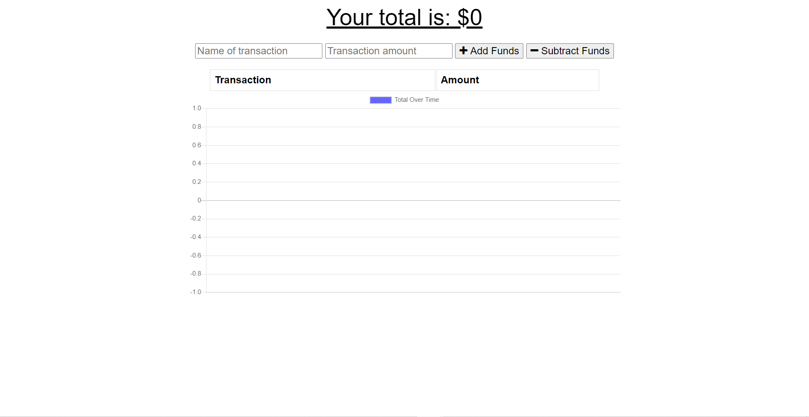
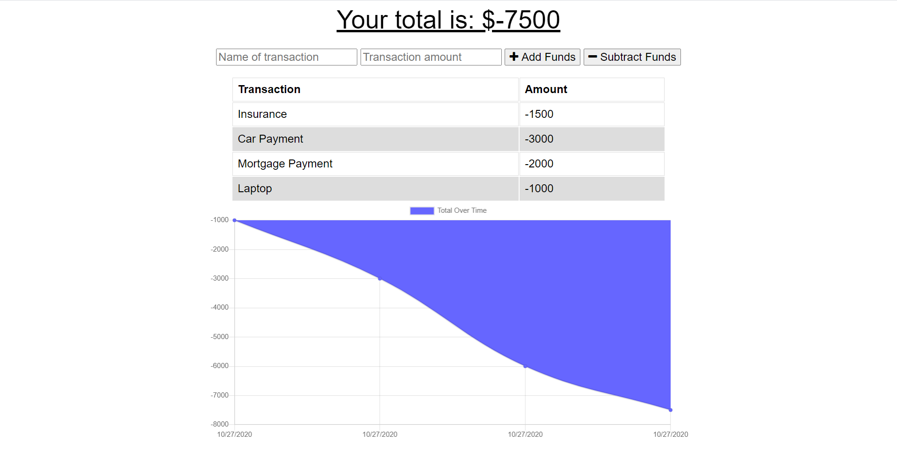
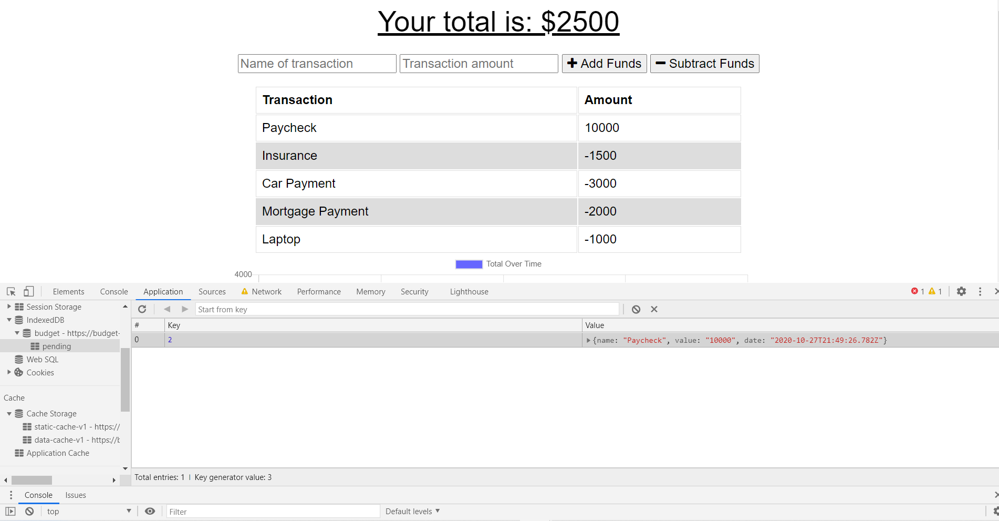
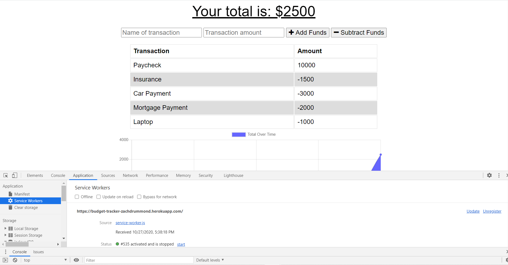

# pwa-budget-tracker

## Table of Contents
* [Description](#Description)
* [Links](#Links)
* [Usage](#Usage)
* [Design Elements](#Design-Elements)
* [App Preview](#App-Preview)
* [Credits](#Credits)

## Description
This progressive web app tracks all of your financial needs in one simple place and allows you to access everything, even if you are offline. You can even download this app on your mobile device. After you add any expenses and/or deposits, a beautiful chart will display everything, including a running total of your account balance. Are you traveling without WIFI or data? You can still add transactions to the app. Once you are online again, simply refresh your browser and all of the transactions that you added when you were offline will be added to the account.

## Links
* Website: https://pwa-budget-tracker-zd.herokuapp.com/
* GitHub Repository: https://github.com/zachdrummond/pwa-budget-tracker

## Usage
1. Add a name for the transaction and the amount.
2. Click "Add Funds" to make a deposit or "Subtract Funds" to make a withdrawal.
3. If you are offline, you can still add transactions. As soon as you are online again, refresh your browser and all of the transactions added offline will be added to the account.

## Design Elements
* Progressive Web App - Manifest, Service-Worker, Cache API
* JavaScript
* Node.js
* Express.js
* Mongoose.js
* MongoDB
* Node Package Manager - Compression, Morgan, Lite-Server
* Model View Controller Architecture
* HTML
* CSS

## App Preview
### *Home Page*

### *Online Transactions*

### *Offline Transaction*

### *Offline Transaction now Online*

## Credits
* https://nodejs.org/en/
* http://expressjs.com/
* https://www.mongodb.com/
* https://mongoosejs.com/
* https://www.npmjs.com/
* https://www.npmjs.com/package/compression
* https://www.npmjs.com/package/morgan
* https://www.npmjs.com/package/lite-server
* https://www.heroku.com/